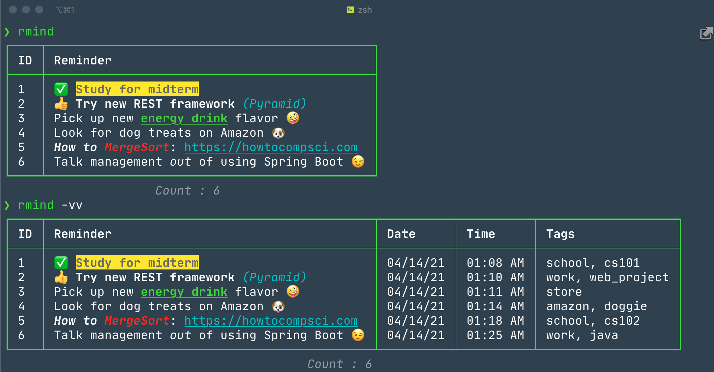
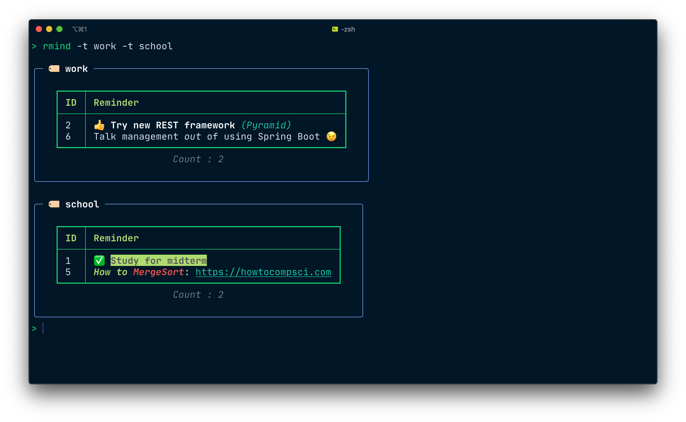

[](https://app.circleci.com/pipelines/github/philFernandez/rmind)


---

### TOC

-   [About](#about)
-   [Usage](#usage)
    -   [Create](#create)
    -   [Read](#read)
    -   [Update](#update)
    -   [Delete](#delete)
- [Install Pre-release](#install-pre-release)
-   [Install Tab Completion](#install-tab-completion)
-   [Motivation](#motivation)
- [Embedded Markup](#embedded-markup)
- [Standing on the Shoulder's of Giants](#standing-on-the-shoulders-of-giants)

---





## About
#### :ledger: A notebook CLI

`rmind` is loosely inspired by another CLI called
[taskwarrior](https://github.com/GothenburgBitFactory/taskwarrior). The goal
of `rmind` is to provide a more streamlined list oriented application, that
takes advantage of modern CLI libraries to pile on the command line eye candy
(tastefully of course :wink:). Taskwarrior is great, and I will continue to
use it for keeping track of structured tasks, but IMHO it isn't ideal for
keeping track of random ideas for future reference. Thats why I made `rmind`.
As a person who spends *a lot* of time in a terminal, I wanted a place to
store my ideas quickly without having to take my hands off the keyboard, and
without needing to open another application, while also having something
that's powerful and nice to look at. `rmind` is my solution to that problem.

#### Features

- Organize notes with tags for easy categorization and batch retrieval
- Embedded inline markup, powered by [rich](https://github.com/willmcgugan/rich), for coloring, styling, and emoji-ing your notes
- Easily edit all aspects of any entry at any time

## Usage

-   #### Create
    -   `rmind add`
        -   invokes a prompt asking for your input.
    -   `rmind add -a 'My awesome note to remember'`
        -   bypasses the prompt and saves input given after `-a`.
    -   `rmind add -t some_tag -a 'Awesome note'`
        -   saves input and association with tag given after `-t`.
        -   `-t` option can be given multiple times for multiple tags.
        -   `-a` option can be omitted to invoke a prompt for your input here too.
-   #### Read
    -   `rmind`
        -   returns all currently saved notes in tabular form.
    -   `rmind -t some_tag`
        -   returns all currently saved notes that are tagged with `some_tag` in tabular form.
        -   `-t` option can be given multiple times.
    -   `rmind -v`
        -   returns all currently saved notes with additional information such as entry date and time in tabular form.
        -   This can also be used with the `-t` option.
    -   `rmind -vv`
        -   same as `-v` but shows additional "Tags" column in tabular output.
-   #### Update
    -   `rmind update [id] -u 'Updated awesome note to remember'`
        -   updates entry with id `[id]` if the id exists in the database.
        -   displays output letting user know if update succeeded.
        -   `-u` option can be omitted to invoke a prompt for your input.
-   #### Delete
    -   `rmind delete [id]`
        -   deletes entry with id `[id]` if the id exists in the database.
        -   displays output letting user know if update succeeded.

## Install Pre-Release
`pip install https://github.com/philFernandez/rmind/archive/refs/tags/v0.2a2.zip`

**Or download the [release archive](https://github.com/philFernandez/rmind/releases/tag/v0.2a2)**


The pre-release is definitely usable. The --help messages aren't completely refined, and there
are still more features and polishing that will show up in the first major release. There will
also be install options for at least PyPi, and probably Homebrew, and possibly more.

## Install Tab Completion

Add one of the following to your shell's startup file.

<!-- eg. `~/.zlogin` or `~/.zshrc` for zsh, `~/.profile` or `~/.bashrc` for bash, and `~/.config/fish/completions/rmind.fish` for fish. -->

-   #### For ZSH - `~/.zshrc` or `~/.zlogin`
    -   #### `eval "$(_RMIND_COMPLETE=source_zsh rmind)"`
-   #### For BASH - `~/.bashrc` or `~/.profile`
    -   #### `eval "$(_RMIND_COMPLETE=source_bash rmind)"`
-   #### For FISH - `~/.config/fish/completions/rmind.fish`
    -   #### `eval "$(_RMIND_COMPLETE=source_fish rmind)"`

---

## Motivation

I'm making this CLI for myself so that I can have a simple place to _quickly_
jot down my ideas in a unified place such that I can revisit them later
without having to remember too much. I previously used note taking
applications, like [vimwiki](https://github.com/vimwiki/vimwiki), OneNote,
Google Keep, but these tend to quickly devolve into a mess of pages and
unorganized musings that asymptote towards worthlessness. I'm not saying
these applications are worthless, they just don't work for me with the goal
of saving and organizing my ideas. Another drawback for me is that some of
these tools are packed with features, which I end up fiddling with more than
I actually record my ideas.

I recently started using [task
warrior](https://github.com/GothenburgBitFactory/taskwarrior) and have found
it to be the best thing for me so far. Its great for keeping track of active
projects, and steps that need to be crossed off a list as completed, but I
still feel like I need something for just jotting down random ideas that pop
up, or random cool things that I discover and want to revisit. I can kind of
make [task warrior](https://github.com/GothenburgBitFactory/taskwarrior) work
for me in that way, but there are still a lot of features in the way that I'd
rather be able to strip out. I just need to be able to capture my ideas in a
sentence or two and have the option to add tags. That way
I can come back later and query the saved data and filter by tag(s). That is
what this project aims to provide.

## Embedded Markup
This is a reference sheet for the supported embbeded markup that can be used with rmind

### Rich Markup Quick Reference

This project uses the [`rich`](https://github.com/Textualize/rich) Python package for terminal text formatting.

Rich supports a lightweight markup syntax called **Console Markup**. It uses square-bracket tags to apply styles to terminal output.

#### Basic Usage

```python
from rich import print

print("[bold]Bold text[/bold]")
print("[red]Red text[/red]")
print("[bold red]Bold red text[/bold red]")
print("[underline blue]Underlined blue text[/underline blue]")
```

#### Common Text Styles

```text
[bold]text[/bold]
[italic]text[/italic]
[underline]text[/underline]
[strike]text[/strike]
[dim]text[/dim]
[reverse]text[/reverse]
[blink]text[/blink]
```

#### Colors

Rich supports named colors:

```text
[red]Error[/red]
[green]Success[/green]
[yellow]Warning[/yellow]
[blue]Info[/blue]
```

Styles and colors can be combined:

```text
[bold yellow]Warning:[/bold yellow] Something happened
```

#### Hex Colors

Rich also supports hex colors:

```text
[#ff8800]Orange text[/#ff8800]
```

#### Background Colors

Use `on` to set a background color:

```text
[black on yellow]Highlighted text[/black on yellow]
```

#### Nested Styles

Tags can be nested:

```text
[bold]Important: [red]failed[/red][/bold]
```

#### Closing Tags

You can close a specific style:

```text
[bold red]Error[/bold red] normal text
```

Or close the most recent style using `[/]`:

```text
[bold red]Error[/] normal text
```

#### Hyperlinks

Rich supports terminal hyperlinks in terminals that support them:

```text
[link=https://example.com]Click here[/link]
```

#### Emoji

Rich can render emoji codes using colon-delimited names:

```text
:warning: Warning
:heavy_check_mark: Done
:rocket: Launch
```

Example:

```python
from rich import print

print(":warning: [bold yellow]Warning[/bold yellow]")
print(":heavy_check_mark: [green]Reminder added[/green]")
print(":x: [bold red]Error[/bold red]")
```

#### Common Emoji Codes

| Code                       | Output meaning      |
| -------------------------- | ------------------- |
| `:warning:`                | warning             |
| `:heavy_check_mark:`       | success / done      |
| `:white_check_mark:`       | success / confirmed |
| `:x:`                      | error / failed      |
| `:cross_mark:`             | error / failed      |
| `:information:`            | information         |
| `:bulb:`                   | idea                |
| `:memo:`                   | note                |
| `:spiral_notepad:`         | note / reminder     |
| `:calendar:`               | calendar            |
| `:alarm_clock:`            | alarm / reminder    |
| `:hourglass:`              | waiting             |
| `:hourglass_flowing_sand:` | in progress         |
| `:rocket:`                 | launch              |
| `:sparkles:`               | highlight           |
| `:star:`                   | favorite            |
| `:fire:`                   | urgent / hot        |
| `:bug:`                    | bug                 |
| `:mag:`                    | search              |
| `:lock:`                   | locked              |
| `:unlock:`                 | unlocked            |
| `:package:`                | package             |
| `:wrench:`                 | tool / fix          |
| `:gear:`                   | settings            |
| `:hammer:`                 | build               |
| `:trash:`                  | delete              |
| `:pencil:`                 | edit                |
| `:bookmark:`               | saved item          |
| `:link:`                   | link                |
| `:paperclip:`              | attachment          |
| `:pushpin:`                | pinned item         |
| `:label:`                  | tag                 |
| `:inbox_tray:`             | inbox               |
| `:outbox_tray:`            | outbox              |
| `:file_folder:`            | folder              |
| `:open_file_folder:`       | open folder         |
| `:floppy_disk:`            | save                |
| `:computer:`               | computer            |
| `:keyboard:`               | keyboard            |
| `:terminal:`               | terminal / CLI      |
| `:snake:`                  | Python              |
| `:eyes:`                   | attention           |
| `:point_right:`            | pointer             |
| `:thumbs_up:`              | approval            |
| `:thumbs_down:`            | rejection           |
| `:clap:`                   | applause            |
| `:pray:`                   | thanks / please     |
| `:smile:`                  | smile               |
| `:grinning:`               | happy               |
| `:thinking:`               | thinking            |
| `:cry:`                    | sad                 |
| `:tada:`                   | celebration         |
| `:zap:`                    | fast / power        |
| `:boom:`                   | impact              |
| `:construction:`           | work in progress    |

## Standing on the Shoulder's of Giants

Without the hard work and passion of those who contribute their time and talent to open source,
this project wouldn't have been possible for me. These projects in particular
play a huge role in making *this* project work.

| Project | How I used it |
|---------|---------------|
| [rich](https://github.com/willmcgugan/rich)    | Tables, colors, styling, emoji. CLI eye candy in general. |
| [click](https://github.com/pallets/click)    | CLI options and arguments parsing, help messages and tab completion. |
| [sqlalchemy](https://github.com/sqlalchemy/sqlalchemy) | Mapping application objects to sql data, and handling the persistence and lookup of said data. |
